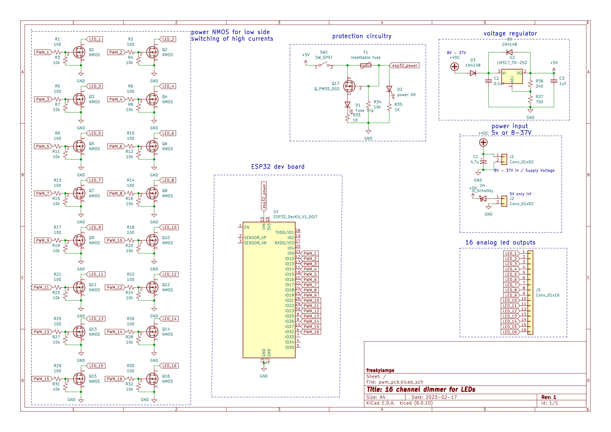
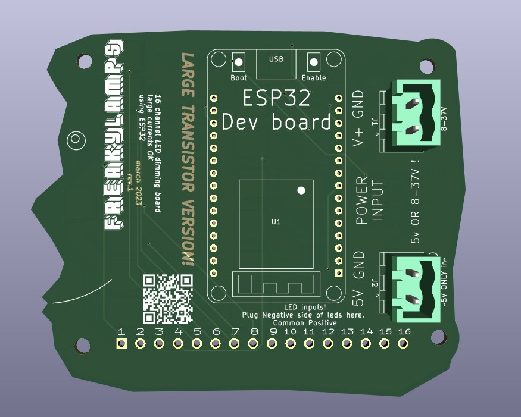
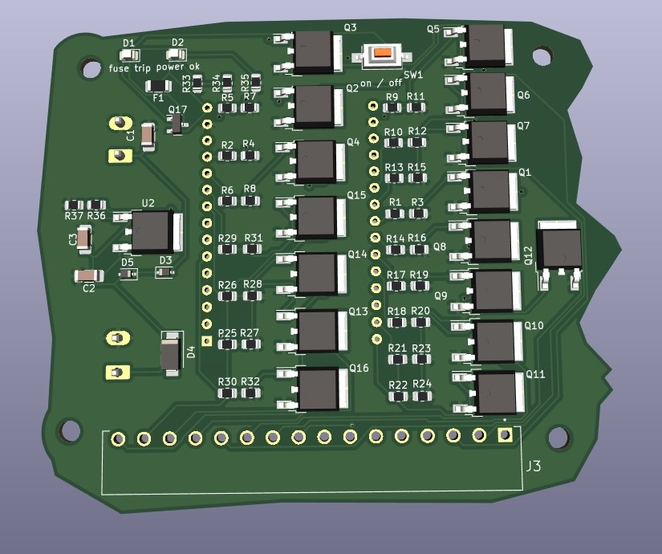
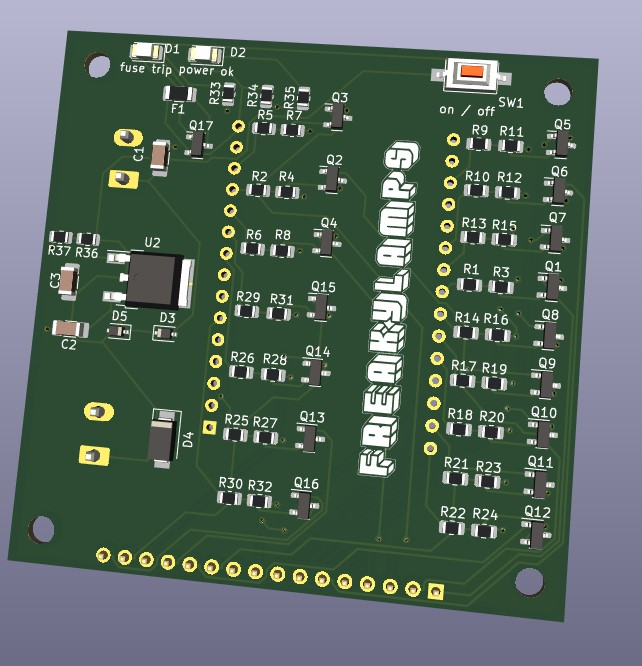
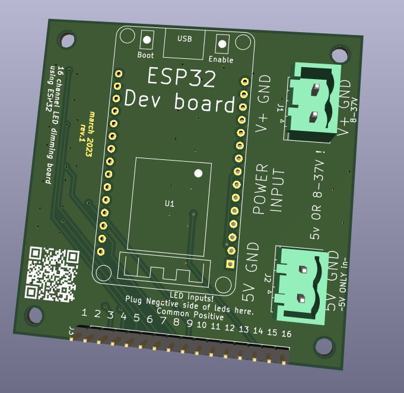

# 16 Channel PWM led dimming board for ESP32

this repo contains the files for a 16 channel pcb to dim leds. 

## Description

I designed this board originally for my friend [Eddie Farr](https://www.instagram.com/freaughouse/?hl=en) for an led sculpture he is working on. I've also wanted something like this for a while to dim analog LED strips easily via WLED or ArtNet, or just plain old locally from a microcontroller.

It is designed to take in voltages from 5 to 37 Volts to power the ESP32. That way you can use this with 12 or 24 volt LEDs and dont have to deal with an extra 5V power supply to power the esp32. 

There are two separate places to put power in. 
EITHER plug 5V into the 5V side, or plug 7 - 37V into the other side. 

## Schematic 

## PCB
pcb with larger transistors:

pcb with smaller transistors:

## Parts references
- using ESP-WROOM-32 dev board. 2.05" x 1.18" like the kind [found here](https://www.amazon.com/ESP-WROOM-32-Development-Microcontroller-Integrated-Compatible/dp/B0BK13HWBJ/ref=sr_1_4?keywords=esp32&qid=1679947379&sr=8-4&th=1)
- Both pcbs mount with M3 screws
- Enclosure mounts with #8 wood screws
-  the larger board uses 3.81mm pitch connector for led outputs
  - 16 channel connector -  pluggable screw terminal block - [TBP02P1-381-16BE](https://www.mouser.com/ProductDetail/490-TBP02P1-381-16BE) 
  - screw terminal receptacle 
[TBP02R1-381-16BE](https://www.mouser.com/ProductDetail/490-TBP02R1-381-16BE)
- smaller board uses 2.54mm connector for led outputs

## Help

Any advise for common problems or issues.

## Authors

[william kennedy](https://freakylamps.com/)

## Version History

* 1.0
    * Initial Release - March 15, 2023
* 1.1
    * new design with larger TO-252 package for NMOS - March 20, 2023

## License

This project is licensed under the [NAME HERE] License - see the LICENSE.md file for details

## Acknowledgments

Inspiration comes from [quinLED's analog boards](https://quinled.info/quinled-an-quad/)