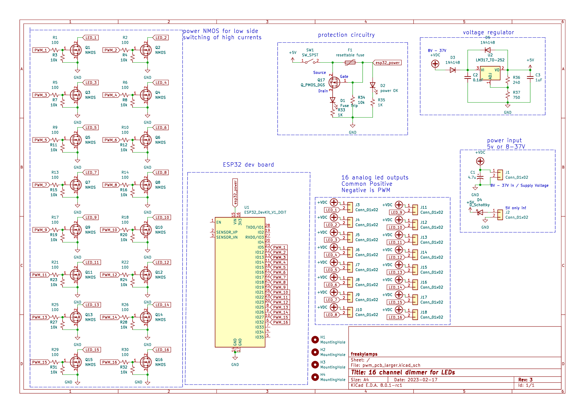
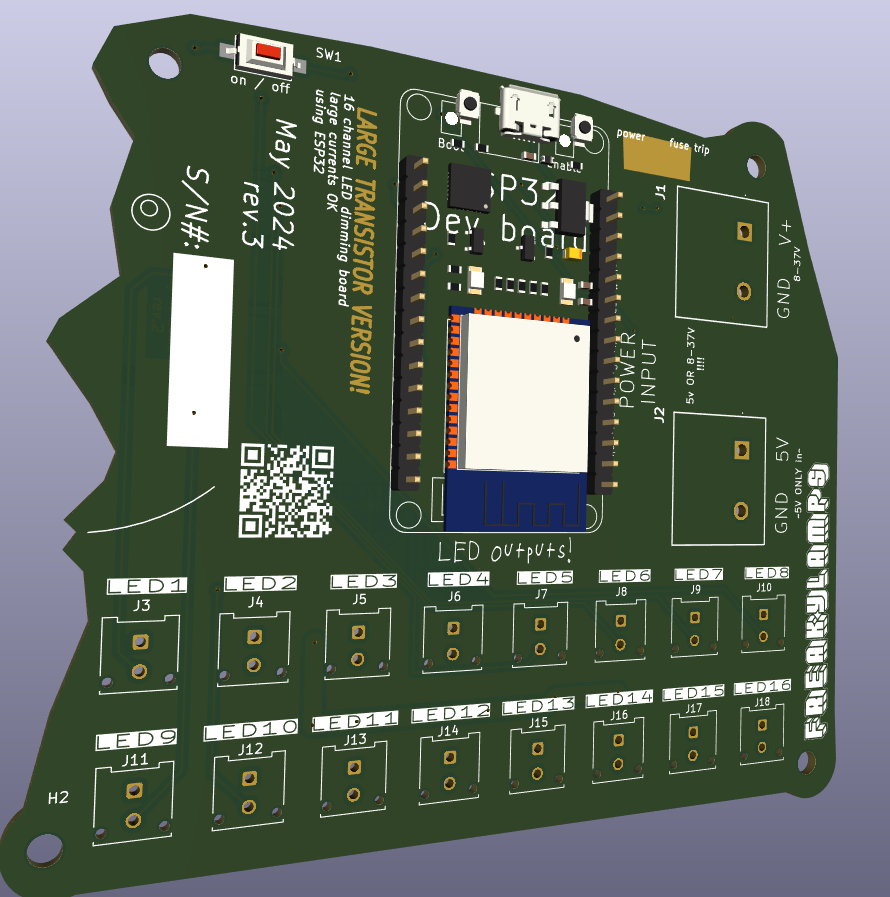
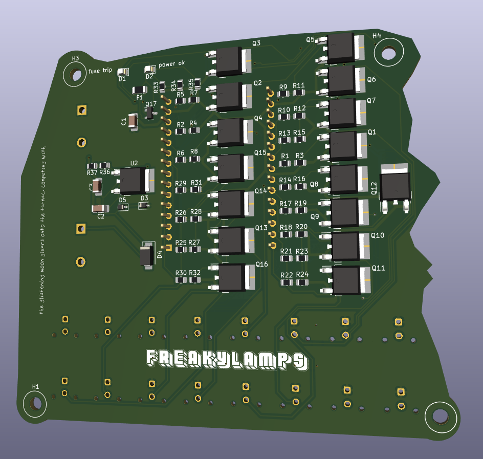

# 16 Channel PWM led dimming board for ESP32

this repo contains the files for a 16 channel pcb to dim LEDS. 

## Description

I designed this board originally for my friend [Eddie Farr](https://www.instagram.com/freaughouse/?hl=en) for an led sculpture he is working on. I've also wanted something like this for a while to dim analog LED strips easily via WLED or ArtNet, or just plain old locally from a microcontroller.

It is designed to take in voltages from 5 to 37 Volts to power the ESP32. That way you can use this with 12 or 24 volt LEDs and dont have to deal with an extra 5V power supply to power the esp32. 

There are two separate places to put power in. 
EITHER plug 5V into the 5V side, or plug 7 - 37V into the other side. 
## pinout

LED1 = GPIO 5

LED2 = GPIO 12

LED3 = GPIO 13

LED4 = GPIO 14

LED5 = GPIO 15

LED6 = GPIO 16

LED7 = GPIO 17

LED8 = GPIO 18

LED9 = GPIO 19

LED10 = GPIO 21

LED11 = GPIO 22

LED12 = GPIO 23

LED13 = GPIO 25

LED14 = GPIO 26

LED15 = GPIO 27

LED16 = GPIO 32
## Schematic 
Rev 3

Rev 1 

## PCB

Rev. 3 - pcb with larger transistors and larger connectors:

Rev. 1 - pcb with larger transistors:

Rev. 1 - pcb with smaller transistors:

## Parts references
### Connectors
- On version 1.3 we are trying out some Molex Microfit connectors
- Crimping tool - [Engineer PA09](https://www.amazon.com/ENGINEER-AWG32-AWG20-Connectors-Oil-Resistant-PA-09/dp/B002AVVO7K?th=1) 
- 
### Common parts
- using ESP-WROOM-32 dev board. 2.05" x 1.18" like the kind [found here](https://www.amazon.com/ESP-WROOM-32-Development-Microcontroller-Integrated-Compatible/dp/B0BK13HWBJ/ref=sr_1_4?keywords=esp32&qid=1679947379&sr=8-4&th=1)
- Both pcbs mount with M3 screws
- board has two places for power. one for 5V and one for 8V - 40V. The two connectors MSTBV/MSTBA Phoenix Type, 5.08 pitch. 
  - straight receptacle/header: [1747993 (green)](https://www.mouser.com/ProductDetail/Phoenix-Contact/1747993?qs=cq3Rj917t3li0%2FrJTXaRgg%3D%3D) or [1836561 (orange)](https://www.mouser.com/ProductDetail/Phoenix-Contact/1836561?qs=RahONj4mt5imYCprRrL9IA%3D%3D) or [1740893 (black)](https://www.mouser.com/ProductDetail/Phoenix-Contact/1740893?qs=o3rrLWFGhRnNm6PoJeAVCw%3D%3D)
  - right angle receptacle/header: [1736036 (green)](https://www.mouser.com/ProductDetail/Phoenix-Contact/1736036?qs=IGPQaF7TU6v9VVAvkUDQlA%3D%3D) or [1702878 (white)](https://www.mouser.com/ProductDetail/Phoenix-Contact/1702878?qs=2WS7V4AoKFqZwxKPPB6GZw%3D%3D) or [1876848 (orange)](https://www.mouser.com/ProductDetail/Phoenix-Contact/1876848?qs=KDxjV83btlSGzDlv5NRfLA%3D%3D)
  - terminal block plug: [Wurth 691351500002](https://www.mouser.com/ProductDetail/Wurth-Elektronik/691351500002?qs=7gQLVZk5cPkg%2FrpRGyiXgA%3D%3D) or [Kobiconn 158-P022ESDVP-E](https://www.mouser.com/ProductDetail/Kobiconn/158-P022ESDVP-E?qs=EibfsPFbZarDIylQPyTRxA%3D%3D) or [Amphenol TJ0251530000G](https://www.mouser.com/ProductDetail/Amphenol-Anytek/TJ0251530000G?qs=Mv7BduZupUjx%252Becl1KCPZg%3D%3D)
### larger pcb
- Enclosure mounts with #8 wood screws
-  the larger board uses 3.81mm pitch connector for led outputs
   - 16 channel plug -  pluggable screw terminal block - [TBP02P1-381-16BE](https://www.mouser.com/ProductDetail/490-TBP02P1-381-16BE) 
   - screw terminal receptacle/header 
[TBP02R1-381-16BE](https://www.mouser.com/ProductDetail/490-TBP02R1-381-16BE)
### smaller pcb
- smaller board uses 2.54mm connector for led outputs

## Help

Any advise for common problems or issues.

## Authors

[william kennedy](https://freakylamps.com/)

## Version History

* 1.0
    * Initial Release - March 15, 2023
* 1.1
    * new design with larger TO-252 package for NMOS - March 20, 2023
* 1.2 - april 5, 2023
  * v2 of smaller board. v1 had NMOS pinout wrong
* Rev 3 - May 22, 2024
  * large boards are now larger, using MicroFit connectors for the led outputs, terminal block for PSU inputs
  * switch is on front now
  * Q17 had pinout wrong
  

## License

This project is licensed under the [NAME HERE] License - see the LICENSE.md file for details

## Acknowledgments

Inspiration comes from [quinLED's analog boards](https://quinled.info/quinled-an-quad/)