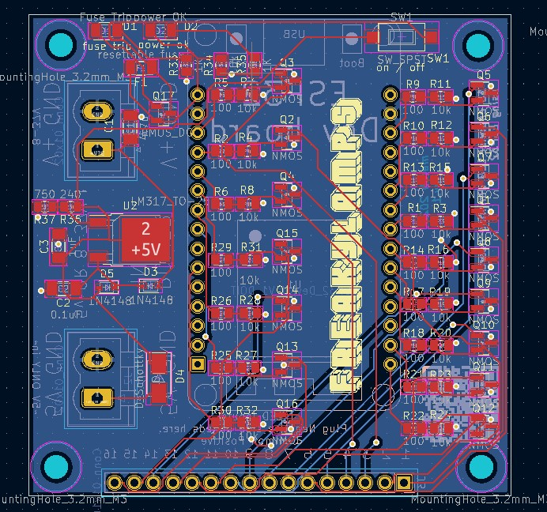
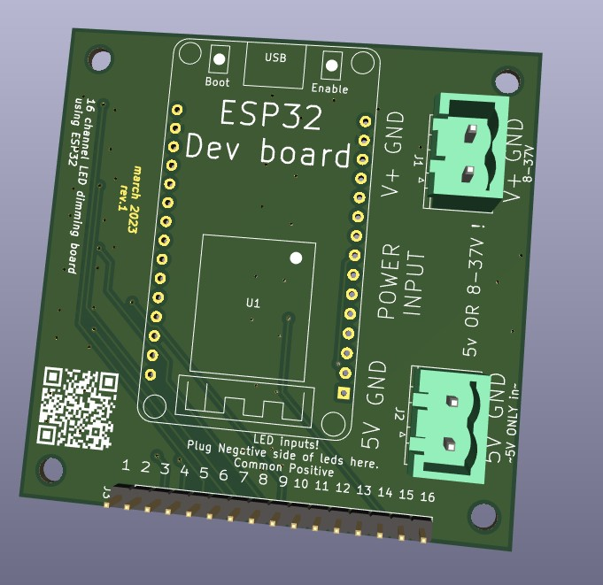

# 16 Channel PWM led dimming board for ESP32 - smaller version with SOT23 NMOS 

this repo contains the files for a 16 channel pcb to dim leds using sot23 NMOS package for less current. 

## Authors

[william kennedy](https://freakylamps.com/)

## Version History

* 1.0
    * Initial Release - March 15, 2023

## License

This project is licensed under the [NAME HERE] License - see the LICENSE.md file for details

## Acknowledgments

Inspiration, code snippets, etc.
