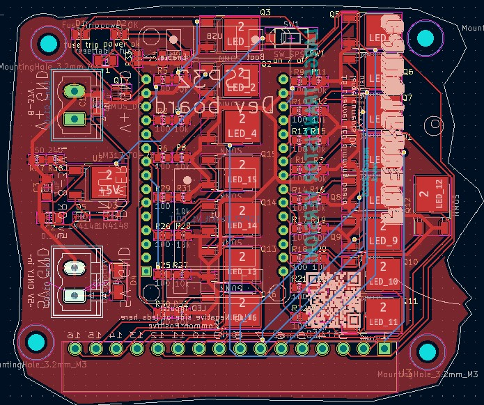

# 16 Channel PWM led dimming board for ESP32 - larger version with TO252 package

this repo contains the files for a 16 channel pcb to dim leds using TO-252 NMOS package for more current. 

## use case 
- WLED to dim analog LED strips
- ArtNet dmx over wifi to the ESP32 to control 16 channels of led wirelessly

## Author

[william kennedy](https://freakylamps.com/)

## Version History

* 1.1
    * Initial Release - March 20, 2023

## License

This project is licensed under the [NAME HERE] License - see the LICENSE.md file for details

## Acknowledgments

Inspiration comes from [quinLED's analog boards](https://quinled.info/quinled-an-quad/)